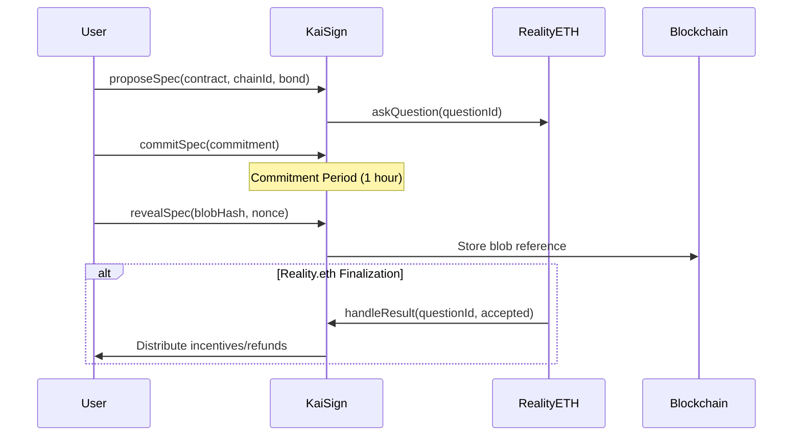

# Technical Documentation - KaiSign v1.0.0

## Table of Contents
1. [System Architecture](#system-architecture)
2. [Contract Overview](#contract-overview)
3. [Development Environment](#development-environment)
4. [Dependencies](#dependencies)
5. [Build Instructions](#build-instructions)
6. [Testing Infrastructure](#testing-infrastructure)

## System Architecture

### High-Level Architecture Diagram

```
┌─────────────────────────────────────────────────────────────┐
│                         Users                               │
│                    (EOAs & Contracts)                       │
└───────────────────────┬─────────────────────────────────────┘
                        │
                        ▼
┌─────────────────────────────────────────────────────────────┐
│                   KaiSign Contract                          │
│   - Spec Management                                         │
│   - Commit/Reveal                                           │
│   - Incentive System                                        │
│   - Access Control                                          │
└───────────────────────┬─────────────────────────────────────┘
                        │
                        ▼
┌─────────────────────────────────────────────────────────────┐
│                  Reality.eth v3.0                           │
│   - Question Creation                                       │
│   - Answer Finalization                                     │
│   - Arbitration                                             │
└─────────────────────────────────────────────────────────────┘
```

### Component Interaction Flow



## Contract Overview

### Core Contract: KaiSign.sol

**Purpose**: Aggregated curator for trusted clear signing metadata registries

**Key Components**:
- **Spec Management**: Handles metadata specification proposals and storage
- **Commit-Reveal Scheme**: Ensures fair submission process with anti-frontrunning
- **Incentive System**: Manages bounties and rewards for valid submissions
- **Integration**: Reality.eth v3.0 for decentralized arbitration
- **Access Control**: Role-based permissions for admin functions

### Contract Architecture

```
KaiSign.sol
├── Inheritance
│   ├── ReentrancyGuard (OpenZeppelin)
│   ├── AccessControl (OpenZeppelin)
│   └── Pausable (OpenZeppelin)
├── External Dependencies
│   └── RealityETH_v3_0
└── Core Modules
    ├── Spec Management
    ├── Commit/Reveal System
    ├── Incentive Pool
    └── Admin Functions
```

## Development Environment

### System Requirements
- **Operating System**: macOS, Linux, or Windows (WSL2 recommended)
- **Node.js**: Not required (using Foundry)
- **Git**: Version 2.0 or higher
- **Foundry**: Latest version

### Foundry Installation
```bash
curl -L https://foundry.paradigm.xyz | bash
foundryup
```

### Environment Setup
```bash
# Clone repository
git clone https://github.com/kaisign/v1-core.git
cd v1-core

# Install dependencies
forge install

# Copy environment variables
cp .env.example .env
# Edit .env with your RPC URLs
```

## Dependencies

### Direct Dependencies
| Dependency | Version | Purpose | Audit Status |
|------------|---------|---------|--------------|
| OpenZeppelin Contracts | 4.9.x | Security primitives | Audited by multiple firms |
| Forge-std | v1.10.0 | Testing framework | Community reviewed |
| Reality.eth v3.0 | 3.0 | Arbitration system | Audited by G0 Group |

### Dependency Tree
```
v1-core/
├── lib/
│   ├── openzeppelin-contracts/ (v4.9.x)
│   │   ├── contracts/
│   │   │   ├── security/
│   │   │   │   ├── ReentrancyGuard.sol
│   │   │   │   └── Pausable.sol
│   │   │   └── access/
│   │   │       └── AccessControl.sol
│   │   └── [audits available in lib/openzeppelin-contracts/audits/]
│   └── forge-std/ (v1.10.0)
│       └── src/
└── staticlib/
    └── RealityETH-3.0.sol (static copy for stability)
```

## Build Instructions

### Compilation
```bash
# Standard build
forge build

# Build with optimization
forge build --optimize --optimizer-runs 200

# Build with size report
forge build --sizes

# Clean and rebuild
forge clean && forge build
```

### Compiler Configuration
- **Solidity Version**: 0.8.20
- **Optimizer**: Enabled
- **Optimizer Runs**: 200
- **Via IR**: Enabled for better optimization
- **EVM Version**: Paris

### Build Artifacts
Build outputs are located in:
- `out/` - Compiled contracts and ABIs
- `cache/` - Build cache (can be deleted safely)

## Testing Infrastructure

### Test Structure
```
test/
├── AuditTests.t.sol         # Security-focused tests
├── ComprehensiveTests.t.sol # Full functionality coverage
├── PracticalWorkflowTest.t.sol # Real-world scenarios
└── TimeTest.t.sol           # Time-dependent functionality
```

### Running Tests
```bash
# Run all tests
forge test

# Run with verbosity
forge test -vvv

# Run specific test file
forge test --match-path test/AuditTests.t.sol

# Run with gas reporting
forge test --gas-report

# Run with coverage
forge coverage

# Fork testing
forge test --fork-url $MAINNET_RPC_URL
```

### Test Categories
1. **Unit Tests**: Individual function testing
2. **Integration Tests**: Multi-component interactions
3. **Security Tests**: Reentrancy, overflow, access control
4. **Scenario Tests**: Real-world usage patterns
5. **Fuzzing Tests**: Property-based testing with random inputs

### Continuous Integration
GitHub Actions workflow runs on:
- Every push to main
- Every pull request
- Nightly security scans

Workflow includes:
- Compilation check
- Full test suite
- Gas consumption reporting
- Coverage analysis